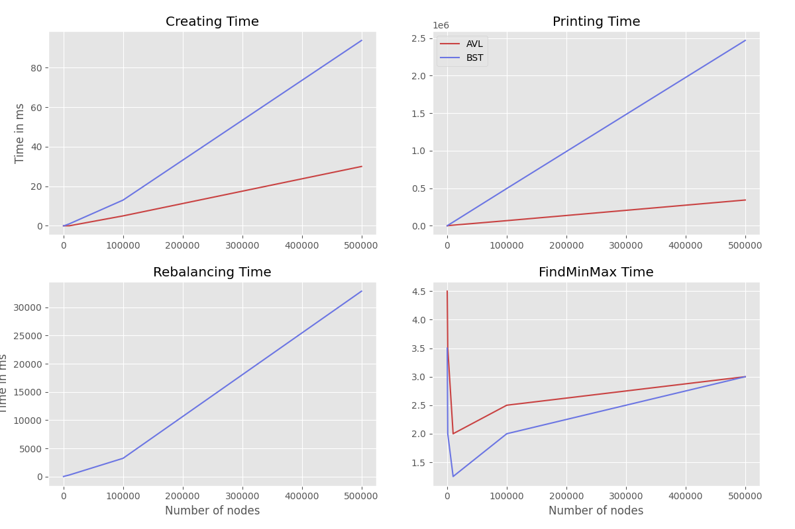

# Drzewa przeszukiwań binarnych BST i drzewa samobalansujące

# Wstęp

W dzisiejszym świecie informatyki, efektywne zarządzanie danymi stanowi
kluczowy element w projektowaniu oprogramowania. Jednym z
najważniejszych aspektów tego zarządzania jest wybór odpowiedniej
struktury danych, która umożliwi szybkie wyszukiwanie, dodawanie i
usuwanie danych. W tym kontekście, drzewa BST (Binary Search Tree) oraz
drzewa AVL odgrywają istotną rolę.

Celem projektu była implementacja drzew BST i AVL oraz badanie
efektywności operacji wykonywanych na tych drzewach. Implementacja
została napisana w językach C++, Python oraz Bash. Testy benchmark
zostały wykonane na komputerze Apple Macbook Air z procesorem M2.

**Projekt dostępny jest w całości na platofrmie
[Github](https://github.com/Skamlo/AiSD-BST).**


<p align="center">
    
</p>
<br><br>

# Tworzenie drzewa BST

Drzewo BST tworzone jest z ciągu liczb. Drzewo BST jest dynamiczną
strukturą danych, w którym lewe poddrzewo każdego węzła zawiera
wyłącznie elementy o kluczach mniejszych niż klucz węzła, a prawe
poddrzewo zawiera wyłącznie elementy o kluczach nie mniejszych niż klucz
węzła.

``` c
NodeBST *insertBST(NodeBST *root, int key)
{
    if (root == nullptr)
    {
        return createNodeBST(key);
    }

    if (key < root->key)
    {
        root->left = insertBST(root->left, key);
    }

    else if (key >= root->key)
    {
        root->right = insertBST(root->right, key);
    }

    return root;
}
```

<br>
<p align="center">
    
</p>
<br><br>

# Tworzenie drzewa AVL

Drzewo AVL w tej implementacji tworzone jest poprzez zastosowanie
algorytmu przeszukiwania połówkowego. AVL jest zrównoważonym drzewem
BST, w którym wysokość lewego i prawego poddrzewa węzła różni się o co
najwyżej jeden.

``` c
NodeAVL *createAVL(std::vector<int> &arr, int start, int end)
{
    if (start > end)
        return nullptr;

    int mid = (start + end) / 2;
    NodeAVL *root = createNodeAVL(arr[mid]);

    root->left = createAVL(arr, start, mid - 1);
    root->right = createAVL(arr, mid + 1, end);

    return root;
}
```

Kluczowym w tej sytuacji jest utrzymanie optymalnej wysokości drzewa,
dlatego dodane zostały funkcje, które w tym celu wykonują rotacje.

``` c
int balanceCoef = balanceCoefficient(root);

// LL case
if (balanceCoef > 1 && key < root->left->key)
{
    return rightRotation(root);
}

// RR case
if (balanceCoef < -1 && key > root->right->key)
{
    return leftRotation(root);
}

// LR case
if (balanceCoef > 1 && key > root->left->key)
{
    root->left = leftRotation(root->left);
    return rightRotation(root);
}

// RL case
if (balanceCoef < -1 && key < root->right->key)
{
    root->right = rightRotation(root->right);
    return leftRotation(root);
}
```


<br>
<p align="center">
    
</p>
<br><br>

# Badanie efektywności operacji

W projekcie zostały zaimplementowanie operacje:

-   Tworzenie drzewa

-   Wyszukiwane elementu w drzewie - średnia złożoność $O(logn)$ a
    pesymistyczna $O(n)$

-   Wypisanie elementów drzewa - złożoność $O(n)$

-   Usuwanie z drzewa pojedyńczych elementów lub całego drzewa - średnia
    złożoność $O(logn)$ a pesymistyczna $O(n)$

-   Równoważenie drzewa - złożoność $O(n)$. W tym projekcie
    zaimplementowany został algorytm DSW, który w celu zrównoważenia
    drzewa najpierw poprzez wielokrotne rotacje w prawo przekształca je
    w winorośl, a następnie poprzez serię rotacji w lewo - w
    zbalansowane drzewo.

Pomiary czasu zostały zrobione za pomocą biblioteki std::chrono. Każdy
zmierzony czas zapisywany jest do pliku. Pliki wejściowe zostały
wygenerowane w instancjach 100, 1000, 10000, 100000, 200000, 300000,
400000 500000. Uruchomienie benchmarku jest wykonane jako skrypt Bash.

Pomiary widoczne na wykresach sa uśrednionymi wartościami 4 pomiarów.

<br>
<p align="center">
    
</p>
<br><br>

Pomiary zgadzają się ze złożonościami teorytycznie omawianymi na
wykładzie. Z powodu implementacji mogą jednak wystąpić błedy pomiarowe.

Z powyższych wykresów wynika, że zarówno operacje tworzenia drzewa jak i
wypisywania są lepiej zoptymalizowane dla drzew AVL. W przypadku
balansowania, mamy do czynienia jedynie z drzewem BST. W przypadku
wykresu dotyczącego znajdowania wartości nawiększej i najmniejszej
wyniki zaskakująco są dość podobne. Może na to mieć wpływ ciąg danych
wejściowych.

# Podsumowanie

Przeprowadzenie projektu związanego z implementacją oraz analizą drzew
BST i AVL dostarczyło cennych wniosków dotyczących efektywności obu tych
struktur danych.<br>
Drzewa BST, dzięki swojej budowie, mogą być bardzo efektywnymi
strukturami danych. Należy pamiętać, że w przypadku drzew BST, dobranie
nieodpowiednych danych prowadzi do przypadku pesymistycznego. Problem
ten rozwiązuje zastosowanie drzewa AVL.<br>
Analiza wyników pomiarów pozwoliła na lepsze zrozumienie charakterystyki
obu struktur danych oraz ich odpowiednich zastosowań.
